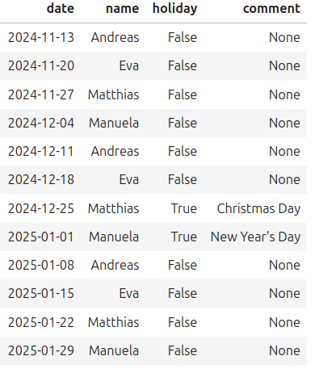

[](https://pyscaffold.org/
)
[](
https://www.python.org/downloads/release/python-3118/
)
[](
https://github.com/ccb-hms/cadence/actions/workflows/pytest.yml
)
[](
https://github.com/ccb-hms/cadence/actions/workflows/docker.yml
)

<p float="left">
    
</p>

## The CCB Meeting Scheduling Repository ##
This repository contains the `Meetings` class based 
on the python [timeboard](https://pypi.org/project/timeboard/) project to 
create the CCB weekly meetings schedule. 
It also serves as a template repository for python projects that need 
a docker container complete with a python development environment and tests.
This repository is also set up to run tests via GitHub actions.
## Install locally with docker ##
1. Install [Docker](https://docs.docker.com/) on your machine.

2. Clone the GitHub project repository to create a local copy of the repository:
```bash
git clone git@github.com:ccb-hms/cadence.git
```

3. Navigate to the repository's directory and build the docker image:
```bash
cd cadence && docker compose build
````
This image will include all the specifications from the Dockerfile based on 
the official [python 3.11](https://hub.docker.com/_/python/tags) docker image and all 
dependencies described in the project's `Pipfile`.

4. Run the docker container:
```bash
docker compose up
``` 
This creates a container and starts a jupyter server which can be accessed through a web browser.

5. Access the jupyter lab server from your browser by clicking on the link that starts with `localhost:8888`.

## Install without docker ##
For installation in a local programming environment we use [Pipenv](https://pipenv.pypa.io/en/latest/) 
to create a pure, repeatable, application environment. 
Mac/windows users should install pipenv into their main python environment as described by the
package [installation instructions](https://pipenv.pypa.io/en/latest/installation.html).
Pipenv is a packaging tool for Python that solves some common problems associated with the typical workflow using pip, 
virtualenv, and the good old requirements.txt. It combines the functionalities of pip and virtualenv into one tool, 
providing a smooth and convenient workflow for developers.

With Pipenv, project dependencies and the virtual environment can be managed easily. 
It uses a Pipfile and Pipfile.lock to keep track of project dependencies with package versions, 
similar to how package.json works in Node.js projects or Gemfile in Ruby.

Pipenv manages dependencies on a per-project basis. 
To install this package, change into your project’s directory and run:
```bash
# Install the package. This assumes that Python version 3.11 is set as the current global python interpreter. 
pipenv install -e .
# Next, install the dev dependencies
pipenv install --dev
# Lastly, run the jupyter lab server in the new environment
pipenv run jupyer lab
```
### Install with other Python versions ###
The package was written for Python 3.11.8 as defined within the project's [Pipfile](./Pipfile).
However, it comes with compatibility libraries to ensure that it can be used with lower Python versions. 
To install this package with a different version of Python, let's say Python 3.10, use the *--python* flag:
```bash
# Install the package using python 3.10 instead of the version defined in the project's Pipfile
pipenv install -e . --python=3.10
```
It is also possible to install the package using a local Python interpreter that is installed in a specific directory,
for example, in a virtual environment created with [Miniconda](https://docs.anaconda.com/miniconda/):
```bash
pipenv install -e , --python=/home/.../miniconda3/envs/pipenv-test/bin/python
```
Where `pipenv-test` is the directory that contains the executable Python interpreter created by Miniconda.

## Create a meeting schedule ##

For a detailed example, refer to the [scheduling_example](notebooks/scheduling_example.ipynb) notebook.
Here you can see how easy it is to create a meeting schedule with just a list of names:

```python
from cadence.mscheduler import Meetings

# Let's start with a list of some names
name_list = ['Andreas', 'Eva', 'Matthias', 'Manuela']

# And we need a start date and an end date for the meeting schedule
start_date = '2024-11-13'
end_date = '2025-1-30'

# We also want the grop to meet once per week on every Wednesday
meeting_day = 2

# Now we create the meeting schedule
meeting = Meetings(name_list=name_list)
schedule = meeting.create_timeboard(start_date=start_date, end_date=end_date, meeting_day=2)
```
This is it. The output of the `create_timeboard` method is a dataframe which can be
saved and imported into other applications, like calendars.

<p float="left">
    
</p>

## Run tests ##
[Pytest](https://docs.pytest.org/en/stable/) is a popular testing framework that makes it easy to write small, 
readable tests. 

The pytest framework scales to support complex functional testing for applications and libraries. Pytest will 
automatically discover and run all the test files in the `./tests` directory that follow the naming conventions 
(i.e., files starting with test_ or ending with _test.py). You can also specify the test directory 
explicitly by running pytest tests/ if your test directory is named tests. 
Pytest will execute all the discovered test cases and provide a detailed summary of passing and failing tests.

To run the tests for this project, simply run the pytest app inside the docker container:
```bash
docker compose run app python -m pytest
```

